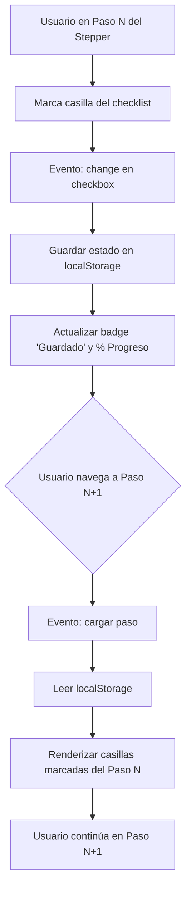

## Flujo IHC-A-08: Persistencia en Checklist (Dashboard UX)

```mermaid
graph TD
    A[Usuario en Paso N del Stepper] --> B[Marca casilla del checklist]
    B --> C[Evento: change en checkbox]
    C --> D[Guardar estado en localStorage]
    D --> E[Actualizar badge 'Guardado' y % Progreso]
    E --> F{Usuario navega a Paso N+1}
    F --> G[Evento: cargar paso]
    G --> H[Leer localStorage]
    H --> I[Renderizar casillas marcadas del Paso N]
    I --> J[Usuario continúa en Paso N+1]
```